# Análisis espectral de la voz

## Asignatura

Procesamiento Digital de Señales

## Programa

Ingeniería Biomédica – Universidad Militar Nueva Granada

## Práctica de laboratorio

**Análisis espectral de la voz**

## Integrantes

Danna Jimena Medina Ríos – Código 5600923
María José Polo Tovar – Código 5600894

---

## Descripción

Este repositorio contiene el desarrollo de la práctica de laboratorio "Análisis espectral de la voz". El objetivo central fue emplear técnicas de análisis espectral para caracterizar y diferenciar señales de voz según el género.
Se grabaron 6 señales de voz (3 mujeres, 3 hombres) pronunciando la misma frase corta de aproximadamente 5 segundos. Cada señal fue procesada en Python para extraer parámetros claves como: frecuencia fundamental, frecuencia media, brillo espectral, intensidad, jitter absoluto y relativo, y shimmer absoluto y relativo. Los resultados se compararon entre géneros utilizando boxplots, gráficos de barras y un análisis estadístico descriptivo.

---

##  Metodología 
En primer lugar, se realizó la importación de librerías y la definición de los archivos de audio junto con sus parámetros de recorte y ventanas de análisis. Posteriormente, cada señal fue leída, recortada en el intervalo de interés y normalizada para garantizar un adecuado procesamiento. Además, se clasificaron las señales según el género de la voz con el fin de establecer rangos de frecuencia apropiados para el análisis.

En una segunda etapa, se llevó a cabo el análisis en el dominio del tiempo y la frecuencia. Se graficó la señal original y se calculó su transformada de Fourier (FFT) para obtener parámetros como la frecuencia fundamental (F0), la frecuencia media (centroide espectral) y la intensidad RMS. Luego, se aplicó un filtro pasa-banda para aislar las componentes relevantes de la señal y se repitió el análisis espectral sobre la señal filtrada.

Finalmente, se realizó un análisis más detallado mediante la selección de una ventana temporal específica, sobre la cual se calculó nuevamente la FFT para estimar la F0 con mayor precisión. A partir de esta ventana, se detectaron los picos de la señal para identificar ciclos, lo que permitió calcular parámetros de variabilidad como el jitter y el shimmer. Todos los resultados obtenidos fueron almacenados en una tabla resumen y posteriormente comparados mediante gráficas, incluyendo diagramas de caja y gráficos de barras, para analizar las diferencias entre voces masculinas y femeninas.

---
### Diagrama de Flujo
<p align="center">
  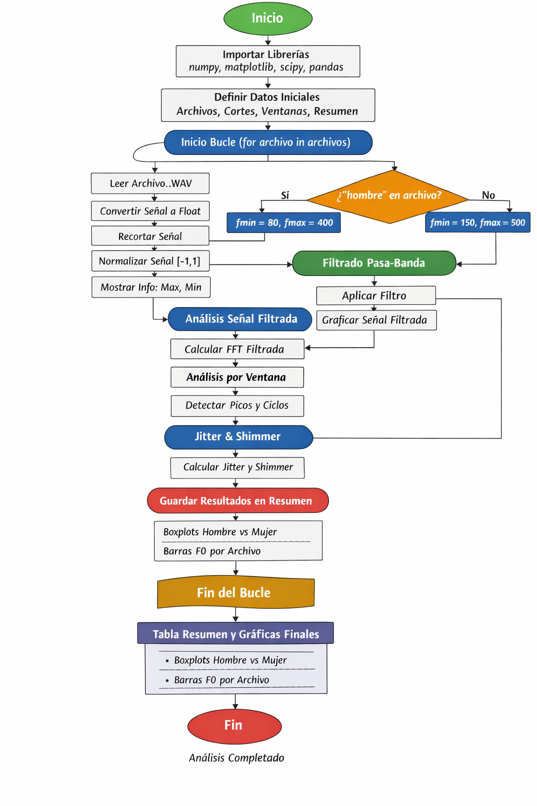
</p>

<p align="center">
  <em>Diagrama de flujo completo código principal
</em>
</p>
---

### PARTE A — Análisis espectral de la señal completa

El primer paso fue cargar cada archivo `.wav` con `scipy.io.wavfile`, que devuelve la frecuencia de muestreo `fs` y el arreglo de muestras. La señal se convierte a `float` para evitar desbordamientos en las operaciones aritméticas siguientes.

Cada grabación incluye silencios al inicio y al final que no aportan información vocal y distorsionarían el espectro cuando se incluyen. Se recortaron manualmente definiendo tiempos de inicio y fin para cada archivo según lo que se observó al inspeccionar visualmente la forma de onda.

```python
from scipy.io import wavfile
import numpy as np
import matplotlib.pyplot as plt

archivos = [
    "mujer1.wav", "mujer2.wav", "mujer3.wav",
    "hombre1.wav", "hombre2.wav", "hombre3.wav"
]

cortes = {
    "mujer1.wav":  (0.76, 5.49),
    "mujer2.wav":  (0.5,  5.0),
    "mujer3.wav":  (0.39, 4.88),
    "hombre1.wav": (0.0,  5.24),
    "hombre2.wav": (0.0,  5.09),
    "hombre3.wav": (1.0,  5.0),
}

fs, senal = wavfile.read("mujer1.wav")
senal = senal.astype(float)

i1, i2 = cortes["mujer1.wav"]
senal = senal[int(i1 * fs): int(i2 * fs)]

senal = senal / (np.max(np.abs(senal)) + 1e-8)

t_full = np.arange(len(senal)) / fs
```

La normalización a [-1, 1] fue necesaria porque las seis grabaciones se hicieron con 3 teléfonos distintos, cada uno con su propia ganancia de micrófono. Sin normalizar, comparar los resultados entre grabaciones reflejaría diferencias. Al llevar todas las señales a la misma escala, los parámetros son comparables. El término `1e-8` en el denominador es una protección numérica para evitar división por cero en el caso hipotético de una señal completamente silenciosa.


#### Gráfica de la señal

```python
plt.figure(figsize=(10, 4))
plt.plot(t_full, senal, linewidth=0.8)
plt.title(f"Señal original: {archivo}")
plt.xlabel("Tiempo (s)")
plt.ylabel("Amplitud normalizada")
plt.grid(True)
plt.tight_layout()
plt.show()
```
---

## Análisis de gráficos mujeres 
  
<p align="center">
  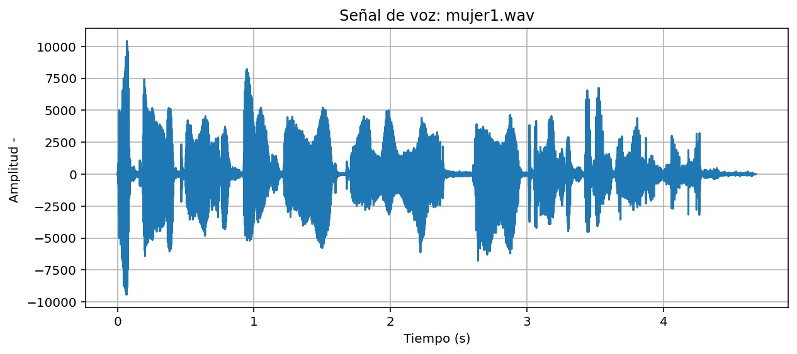
</p>

<p align="center">
  <em>Señal de voz mujer1</em>
</p>

**mujer1.wav:** mantiene una amplitud estable de ±10000 durante los 4.5 segundos de grabación, con segmentos vocales y pausas bien diferenciados entre sí. Hay un pico pequeño al inicio que probablemente corresponde a un artefacto del micrófono, y la energía baja de forma natural hacia el final de la frase.

---

<p align="center">
  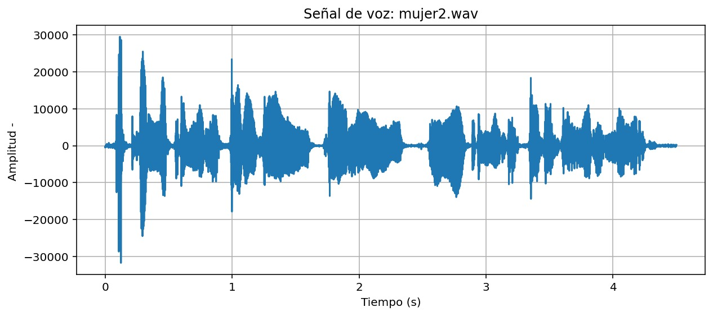
</p>

<p align="center">
  <em>Señal de voz mujer2</em>
</p>

**mujer2.wav:** es la grabación más intensa de las tres, con amplitudes que llegan a ±30000, lo que indica que habló más cerca del micrófono o con mayor volumen. Al inicio hay un pico muy pronunciado que puede ser una consonante explosiva. Las palabras están bien separadas por pausas claras, aunque la alta amplitud introduce error en el cálculo del shimmer en zonas cercanas a saturación.

---

<p align="center">
  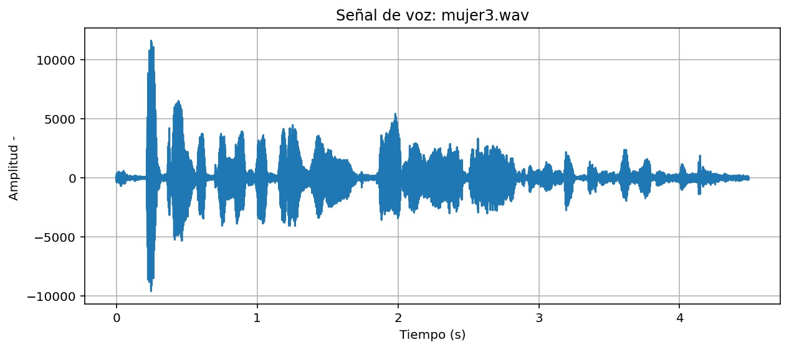
</p>

<p align="center">
  <em>Señal de voz mujer3</em>
</p>

**mujer3.wav:** es visualmente la más limpia. Su amplitud es moderada (±12000) y la energía se concentra en el primer segundo y medio de la grabación, decayendo progresivamente después, lo que sugiere que la frase se dijo con más énfasis al comienzo. El ruido de fondo es el menos visible de las tres grabaciones.

---
---
## Análisis de gráficos hombres 
- Espectro sin filtro
  
<p align="center">
  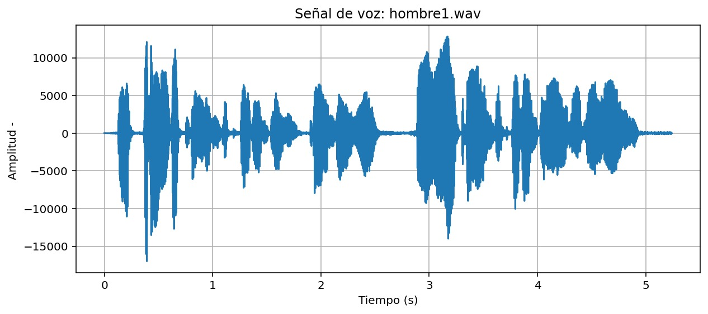
</p>

<p align="center">
  <em>Señal de voz hombre1</em>
</p>

**hombre1.wav:** tiene una grabación de 5.2 segundos con amplitud de ±15000, donde se distinguen claramente los grupos de palabras separados por pausas en los segundos 0.7, 2.0 y 2.8. La energía no es pareja a lo largo de la señal: hay una zona más tranquila entre el segundo 1 y 2.5, y un pico notable alrededor de los 3 segundos que probablemente corresponde a una sílaba acentuada. Los picos positivos son ligeramente más grandes que los negativos, lo que puede deberse a la posición del micrófono o la forma de articular.

---
<p align="center">
  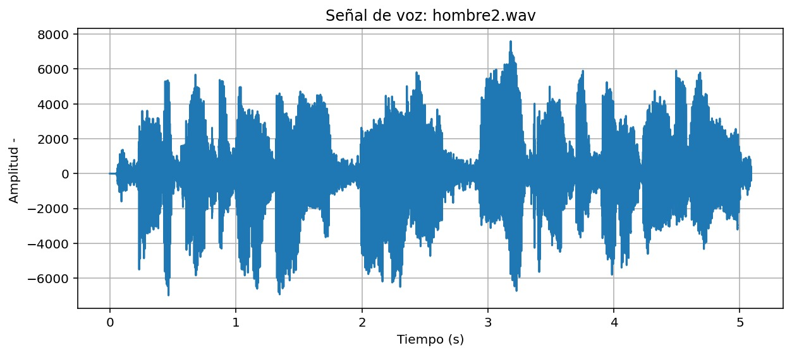
</p>

<p align="center">
  <em>Señal de voz hombre2</em>
</p>

**hombre2.wav:** es la grabación de menor volumen de los tres (±7000), posiblemente porque habló más lejos del micrófono. A diferencia de hombre1, su señal es densa y continua durante casi los 5 segundos completos, sin pausas claras entre palabras. El trazo es muy denso a lo largo de toda la grabación, lo que sugiere buena presencia de frecuencias altas, ya sea por fricativas frecuentes o por las características naturales de su voz. La energía es bastante estable con un pequeño aumento hacia el final.

---
<p align="center">
  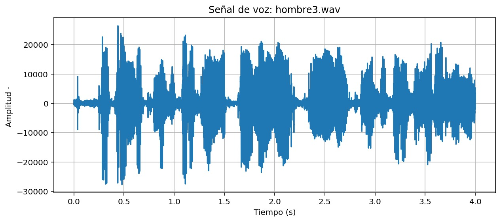
</p>

<p align="center">
  <em>Señal de voz hombre3</em>
</p>

**hombre3.wav:** es el de mayor amplitud de los tres (±30000) y también el de menor duración, con unos 4 segundos. Se identifican entre 6 y 7 segmentos vocales bien delimitados con pausas cortas y regulares entre ellos. Lo más llamativo es que la energía se mantiene alta y constante de principio a fin, sin la caída natural que suele verse al terminar una frase. A pesar de la alta amplitud, la señal es simétrica entre positivo y negativo, lo que indica que no hay saturación.

---

### Espectro de magnitud

La Transformada Rápida de Fourier convierte la señal del dominio del tiempo al dominio de la frecuencia. Para una señal real de N muestras, la FFT produce N valores complejos, de los cuales solo los primeros N/2 son informativos por simetría. La magnitud de cada componente indica cuánta energía tiene la señal en esa frecuencia.

El eje de frecuencias se representa en escala logarítmica porque la percepción auditiva humana es logarítmica: cada octava musical duplica la frecuencia, y la voz tiene contenido relevante desde 80 Hz hasta más de 4 kHz, un rango de 50:1. En escala lineal, los componentes graves donde vive la F0 quedarían comprimidos en el extremo izquierdo y serían casi ilegibles.

```python
N_orig = len(senal)
fft_orig  = np.fft.fft(senal)
frec_orig = np.fft.fftfreq(N_orig, 1 / fs)[:N_orig // 2]
mag_orig  = np.abs(fft_orig)[:N_orig // 2]

plt.figure(figsize=(12, 4))
plt.semilogx(frec_orig, mag_orig, linewidth=0.8)
plt.xlim(20, 4000)
plt.title(f"Espectro señal original: {archivo}")
plt.xlabel("Frecuencia (Hz)")
plt.ylabel("Magnitud")
plt.grid(True)
plt.tight_layout()
plt.show()
```

  
<p align="center">
  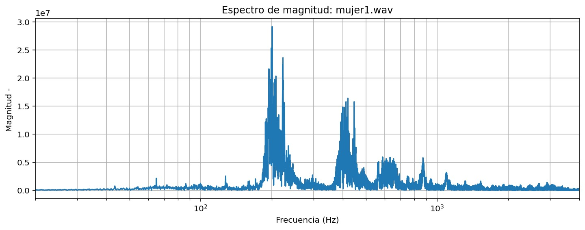
</p>

<p align="center">
  <em>Espectro de magnitud mujer1</em>
</p>

**mujer1.wav:** se distinguen dos grupos de picos: uno entre 300–400 Hz con un máximo de 2.9×10⁷, y otro entre 500–700 Hz, que corresponden a la frecuencia fundamental y sus primeros armónicos junto con los formantes vocálicos. La energía cae rápido por encima de 1000 Hz y hay muy poco contenido por debajo de 100 Hz, lo que habla de una buena calidad de grabación y un timbre relativamente grave para una voz femenina.

---
<p align="center">
  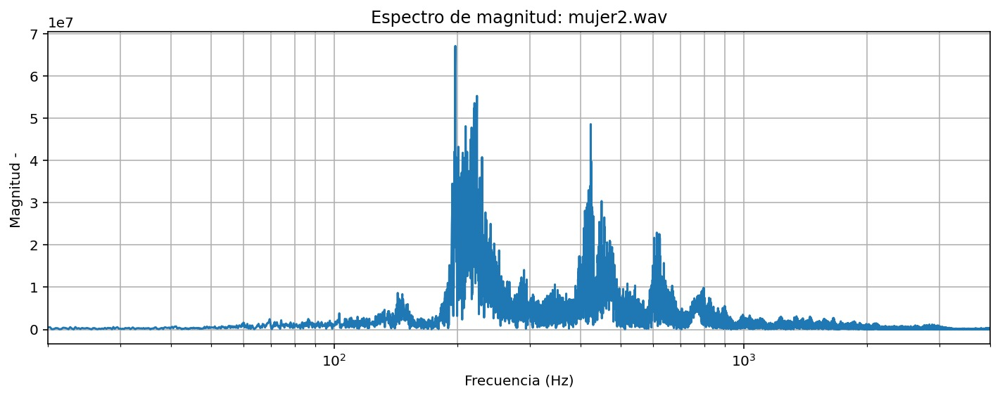
</p>

<p align="center">
  <em>Espectro de magnitud mujer2</em>
</p>

**mujer2.wav:** presenta la mayor magnitud de las tres, alcanzando 6.7×10⁷, coherente con la alta amplitud que ya se veía en su señal temporal. Sus picos principales están entre 250–350 Hz, con un segundo grupo cerca de 500 Hz y un tercero visible entre 600–700 Hz. La distribución armónica es ordenada y bien definida, lo que refleja una voz con buena proyección y periodicidad estable. Hay algo de energía por encima de 1000 Hz aunque bastante atenuada.

---
<p align="center">
  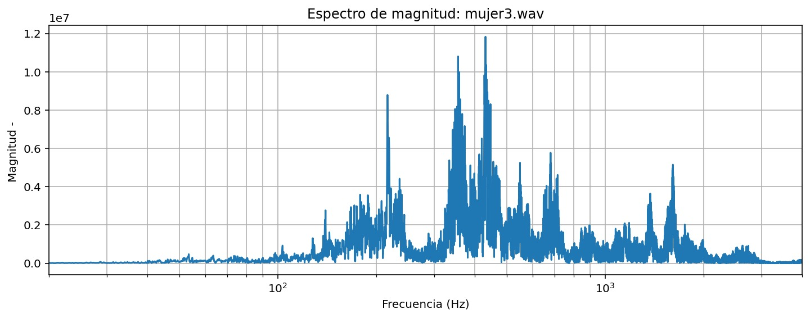
</p>

<p align="center">
  <em>Espectro de magnitud mujer3</em>
</p>

**mujer3.wav:** es la más distinta de las tres. Su energía no se concentra en uno o dos grupos sino que se distribuye desde 200 Hz hasta cerca de 1500 Hz, con el pico más alto (~1.2×10⁷) entre 400–450 Hz. Esta distribución amplia indica una voz con mayor brillo, más armónicos presentes y posiblemente más consonantes fricativas en la frase grabada que en las otras dos.

---

### - Espectro de magnitud

#### F0, frecuencia media, brillo e intensidad 

Con el espectro calculado se extraen los parámetros que caracterizan cada voz. La F0 se identifica como el pico de mayor magnitud dentro del rango de frecuencias esperado para cada género: 80–400 Hz para hombres y 150–500 Hz para mujeres. Estos rangos no son arbitrarios corresponden a las diferencias anatómicas de la laringe entre géneros. En hombres, las cuerdas vocales miden entre 17 y 25 mm tras la pubertad; en mujeres, entre 12 y 17 mm. Una cuerda vocal más larga y masiva vibra más lentamente, produciendo una F0 menor. La testosterona es el responsable fisiológico de este crecimiento diferencial durante la adolescencia.

El centroide espectral, que en este trabajo se usa como medida de frecuencia media y brillo, es la media ponderada de las frecuencias usando la magnitud como peso: `Σ(f · |X(f)|) / Σ|X(f)|`. Representa el "centro de gravedad" del espectro. Una voz brillante y aguda tiene su centroide desplazado hacia frecuencias altas, una voz oscura y grave lo tiene desplazado hacia las bajas. 

```python

if "hombre" in archivo:
    fmin, fmax = 80, 400
else:
    fmin, fmax = 150, 500

idx_f0  = np.where((frec_orig >= fmin) & (frec_orig <= fmax))[0]
f0_orig = frec_orig[idx_f0[np.argmax(mag_orig[idx_f0])]]

f_media = np.sum(frec_orig * mag_orig) / (np.sum(mag_orig) + 1e-8)
brillo  = f_media

rms = np.sqrt(np.mean(senal ** 2))

print(f"  F0 (señal original) : {f0_orig:.2f} Hz")
print(f"  Frecuencia media    : {f_media:.2f} Hz")
print(f"  Intensidad RMS      : {rms:.4f}")
```

---


<p align="center">
  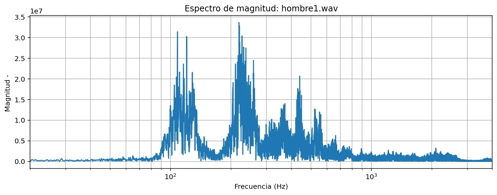
</p>

<p align="center">
  <em>Espectro de magnitud hombre1</em>
</p>
  
**hombre1.wav:** presenta tres grupos armónicos bien definidos: el primero entre 80–150 Hz, el segundo entre 200–300 Hz con el pico más alto del espectro (~3.4×10⁷), y un tercero entre 500–700 Hz. Esta distribución apunta a una F0 alrededor de 100–120 Hz, típica de una voz masculina adulta. Hay contenido residual hasta los 4000 Hz, lo que le da algo de brillo al timbre. De los tres, es el que tiene la distribución armónica más equilibrada.

---
<p align="center">
  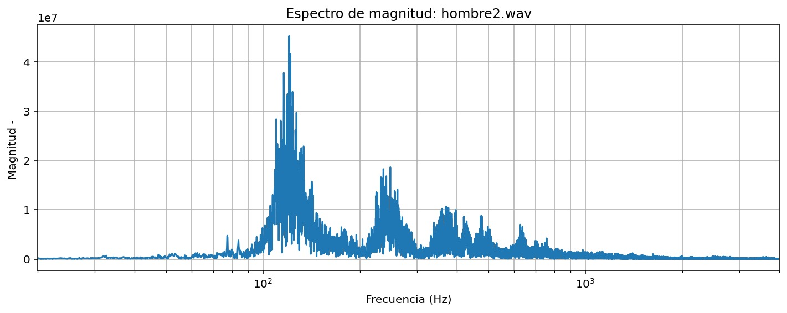
</p>

<p align="center">
  <em>Espectro de magnitud hombre2</em>
</p>
  
**hombre2.wav:** concentra casi toda su energía en un rango muy estrecho entre 100–170 Hz, con un pico máximo de 4.6×10⁷ que es el más alto de los tres a pesar de ser la grabación de menor volumen. Los armónicos secundarios a 280–350 Hz y cerca de 500 Hz están presentes pero son notablemente más débiles. La energía cae rápido después de 600 Hz y prácticamente desaparece por encima de 1000 Hz, lo que resulta en un timbre oscuro y poco brillante comparado con los otros dos.

---
<p align="center">
  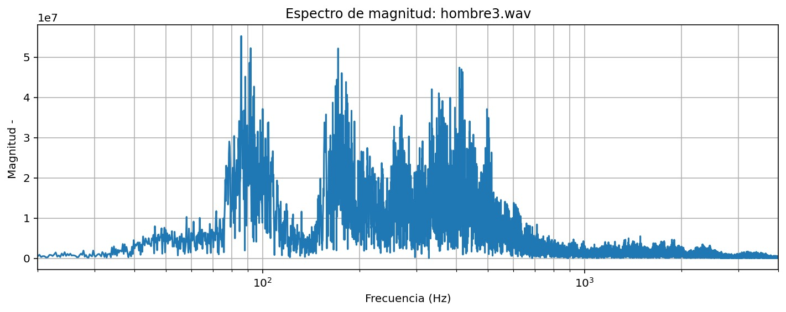
</p>

<p align="center">
  <em>Espectro de magnitud hombre3</em>
</p>
  
**hombre3.wav:** es el más grave y el de espectro más rico de los tres. Tiene cuatro grupos de picos entre 70 y 600 Hz, con magnitudes bastante similares entre sí (entre 4.8×10⁷ y 5.5×10⁷), sin que ninguno domine claramente sobre los demás. Esto indica una F0 baja (~85–100 Hz) con una serie armónica muy completa. La energía llega con algo de presencia hasta los 1000 Hz, confirmando una voz resonante y con cuerpo.


## Señal original vs filtrada – Mujeres


<p align="center">
  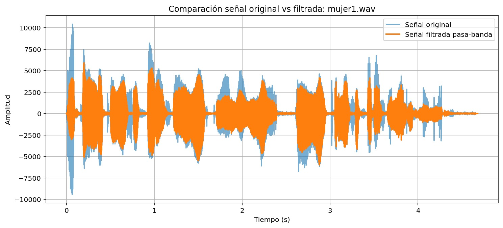
</p>

<p align="center">
  <em>Señal original vs filtrada mujer1</em>
</p>

<p align="center">
  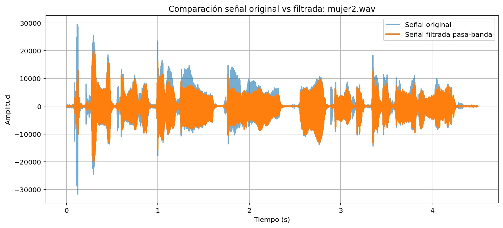
</p>

<p align="center">
  <em>Señal original vs filtrada mujer2</em>
</p>

<p align="center">
  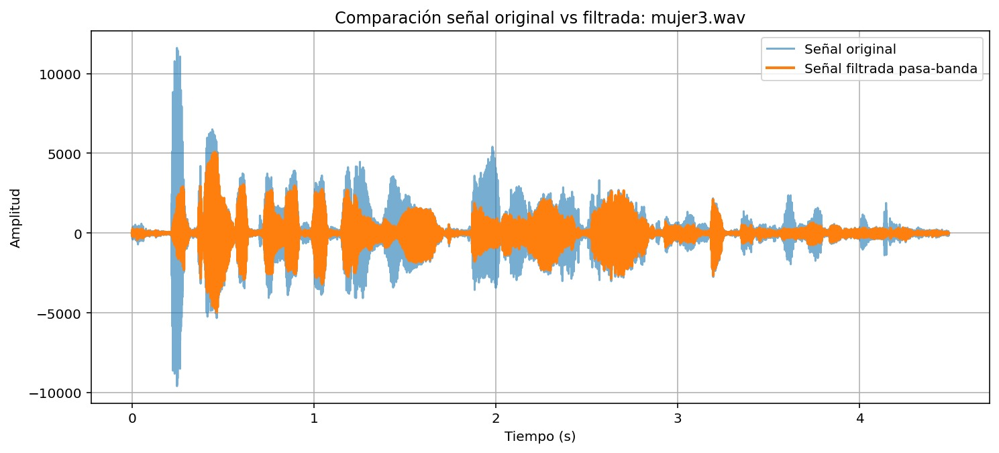
</p>

<p align="center">
  <em>Señal original vs filtrada mujer3</em>
</p>

El filtro pasa-banda funcionó correctamente en las tres grabaciones, capturando la componente glotal y eliminando el contenido fuera del rango de interés. En mujer1 el solapamiento entre la señal original y la filtrada fue el más uniforme de las tres, lo que indica que su energía vocal está bien concentrada dentro del rango 150–500 Hz. En mujer2 la mayor diferencia se da en los transitorios iniciales de alta amplitud, pero en el resto de la grabación el seguimiento es bueno. Mujer3 es la que más energía pierde tras el filtrado, especialmente en la segunda mitad, consecuencia de su F0 más alta y su espectro más distribuido en frecuencias altas. En general el filtro cumplió su propósito en los tres casos y dejó una señal limpia para el análisis posterior de jitter y shimmer.

---
#### Filtro Butterworth pasa-banda

Antes de medir jitter y shimmer es necesario aislar la banda vocal y eliminar el ruido fuera del rango de interés. El ruido de alta frecuencia puede crear falsos picos en la señal, conduciendo a estimaciones erróneas de los períodos y amplitudes glóticas. Se usa un filtro Butterworth de orden 4 porque tiene respuesta maximalmente plana en la banda de paso, lo que significa que no distorsiona las amplitudes relativas de los armónicos vocales dentro del rango: exactamente lo que se necesita para que el shimmer refleje la variabilidad real de la voz y no una distorsión introducida por el filtro.

`filtfilt` aplica el filtro en dos pasadas —hacia adelante y hacia atrás— cancelando el desfase de fase. Si se usara `lfilter`, los picos quedarían desplazados en el tiempo, y los períodos Ti medidos para el jitter serían incorrectos.

```python
from scipy.signal import butter, filtfilt

nyquist = fs / 2
b, a = butter(4, [fmin / nyquist, fmax / nyquist], btype='band')
senal_f = filtfilt(b, a, senal)
senal_f = senal_f / (np.max(np.abs(senal_f)) + 1e-8)

plt.figure(figsize=(10, 4))
plt.plot(t_full, senal,   label="Original", alpha=0.5, linewidth=0.8)
plt.plot(t_full, senal_f, label="Filtrada",  linewidth=0.9)
plt.legend()
plt.title(f"Señal original vs. filtrada: {archivo}  [{fmin}–{fmax} Hz]")
plt.xlabel("Tiempo (s)")
plt.ylabel("Amplitud normalizada")
plt.grid(True)
plt.tight_layout()
plt.show()
```


## Señal original vs filtrada – Hombres
<p align="center">
  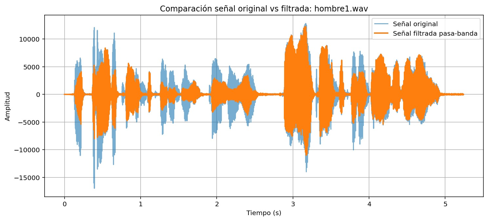
</p>

<p align="center">
  <em>Señal original vs filtrada hombre1</em>
</p>

<p align="center">
  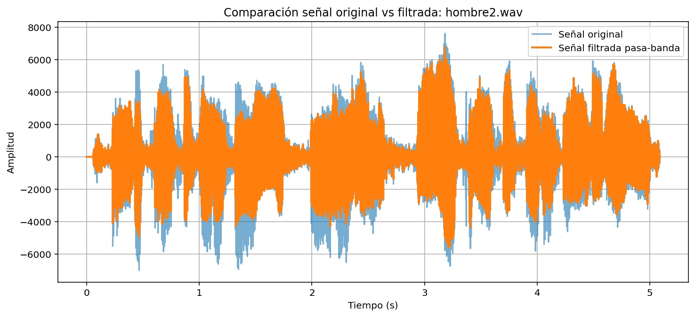
</p>

<p align="center">
  <em>Señal original vs filtrada hombre2</em>
</p>

<p align="center">
  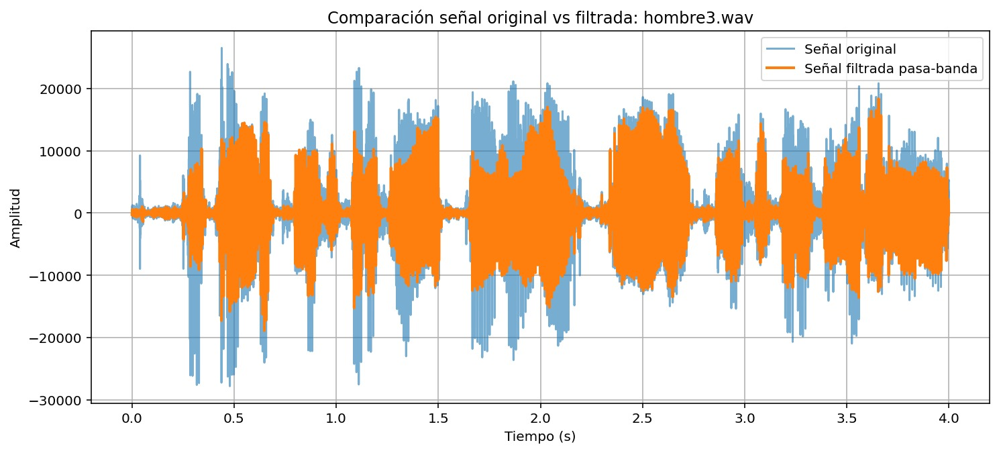
</p>

<p align="center">
  <em>Señal original vs filtrada hombre3</em>
</p>

El filtro pasa-banda funcionó correctamente en los tres hombres, aunque con diferencias notables entre ellos. En hombre1 el seguimiento es bueno durante los segmentos vocales, pero hay zonas donde la señal original supera claramente a la filtrada, especialmente en los picos negativos de mayor amplitud, lo que indica que parte de su energía vocal está fuera del rango 80–400 Hz. En hombre2 es donde mejor funciona el filtro: la señal naranja cubre casi completamente la original a lo largo de toda la grabación, lo que confirma que la mayor parte de su energía vocal está concentrada dentro del rango filtrado, algo coherente con el espectro dominado por frecuencias bajas que se vio antes. En hombre3 la diferencia entre ambas señales es la más evidente de los tres, con la original superando ampliamente a la filtrada en varios segmentos, lo que se explica por la riqueza armónica de su voz y la cantidad de energía que tiene distribuida fuera del rango del filtro. En general el filtro cumplió su función en los tres casos, siendo más eficiente en hombre2 y dejando más contenido fuera en hombre3.


---
### Espectro de la magnitud de la señal filtrada


<p align="center">
  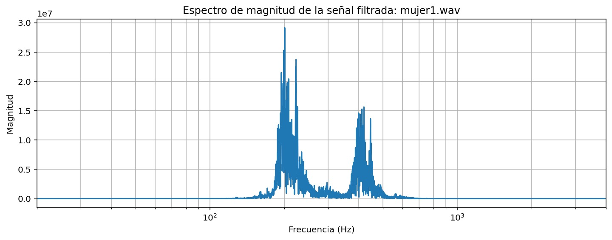
</p>

<p align="center">
  <em>Espectro de la magnitud de la señal filtrada mujer1</em>
</p>

**mujer1.wav:** el filtro delimitó bien la energía entre 150 y 500 Hz, dejando dos grupos de picos claramente separados: el principal entre 300–350 Hz con un máximo de 2.9×10⁷, y el secundario entre 450–500 Hz. La separación limpia entre ambos confirma una F0 bien definida cerca de 300 Hz con su primer armónico visible, sin que el filtro haya alterado la estructura original de la señal.

---
<p align="center">
  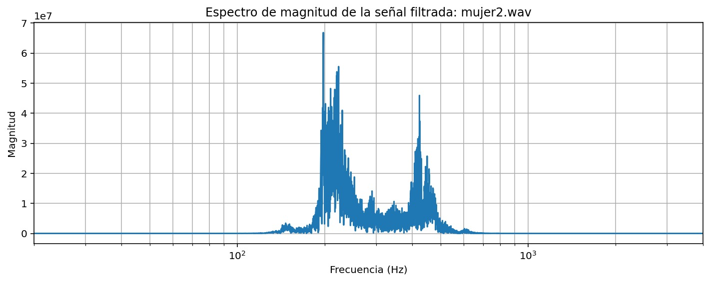
</p>

<p align="center">
  <em>Espectro de la magnitud de la señal filtrada mujer2</em>
</p>

**mujer2.wav:** quedó limitada al rango de interés, conservando sus picos principales entre 250–350 Hz (máximo 6.7×10⁷, el más alto de las tres) y un segundo grupo entre 450–500 Hz. Todo el contenido por encima de 500 Hz fue eliminado sin afectar los picos vocales, lo que confirma que el filtro fue bien aplicado. La alta magnitud es simplemente reflejo del mayor volumen con el que fue grabada.

---
<p align="center">
  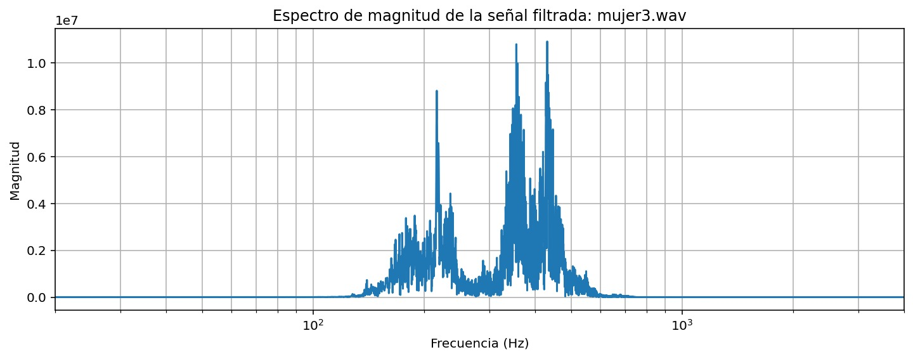
</p>

<p align="center">
  <em>Espectro de la magnitud de la señal filtrada mujer3</em>
</p>

**mujer3.wav:** es la más particular de las tres después del filtrado. A diferencia de las otras dos, su pico dominante aparece en la parte alta del rango, entre 380–500 Hz, con un pico secundario cerca de 250 Hz. Esto es consistente con la F0 más alta de las tres (~430 Hz) y tiene sentido fisiológicamente: una voz más aguda concentra su energía fundamental en frecuencias más altas dentro del rango filtrado. El filtro funcionó correctamente aunque capturó menos armónicos completos que en los otros dos casos por la posición elevada de su F0.

 ---
### - Espectro de la magnitud de la señal filtrada
  
<p align="center">
  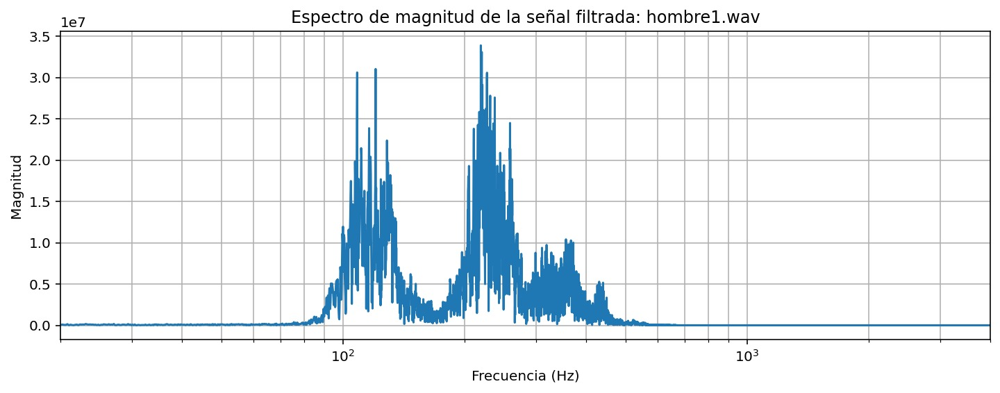
</p>

<p align="center">
  <em>Espectro de la magnitud de la señal filtrada hombre1</em>
</p>

**hombre1.wav:** el filtro delimitó bien la energía entre 80 y 400 Hz, conservando dos grupos de picos con un valle claro entre ellos alrededor de 170 Hz. El primero está entre 80–150 Hz y el segundo entre 200–300 Hz con el pico más alto (~3.4×10⁷). Esa separación limpia entre ambos confirma el F0 y su segundo armónico bien diferenciados, lo que hace de esta señal la más favorable de las tres para calcular jitter y shimmer con precisión.

---
<p align="center">
  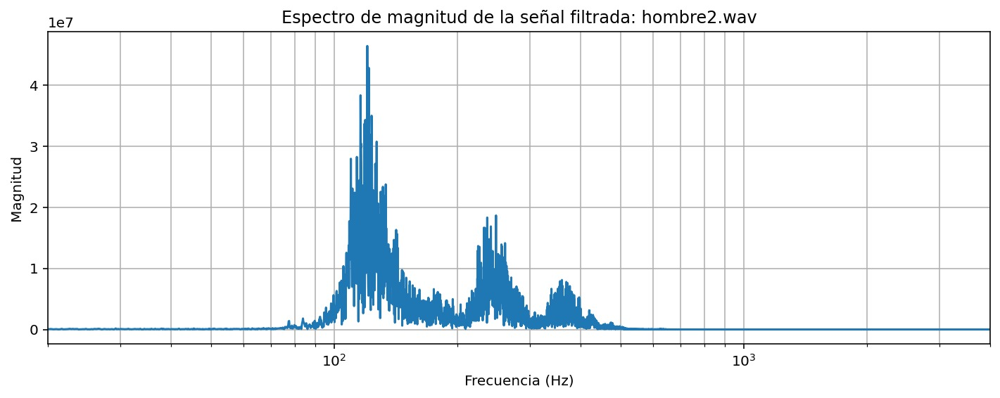
</p>

<p align="center">
  <em>Espectro de la magnitud de la señal filtrada hombre2</em>
</p>

**hombre2.wav:** quedó con un pico muy dominante entre 100–170 Hz (máximo 4.6×10⁷), el más alto de los tres dentro del rango filtrado, seguido de un segundo grupo en 280–320 Hz y uno más pequeño justo en el límite del filtro cerca de 400 Hz. La diferencia de magnitud entre el primer pico y los demás es grande, lo que ratifica que esta voz concentra casi toda su energía en la frecuencia fundamental con poca presencia de armónicos, algo ya evidente en el espectro sin filtrar..

---
<p align="center">
  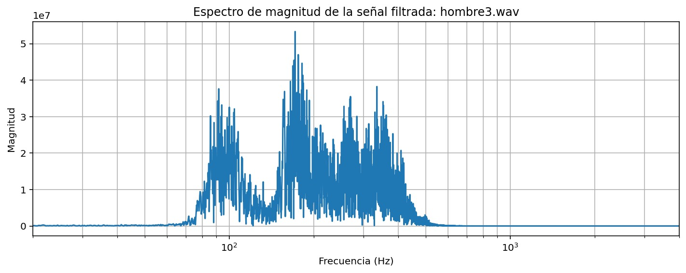
</p>

<p align="center">
  <em>Espectro de la magnitud de la señal filtrada hombre3</em>
</p>

**hombre3.wav:** es el más ancho y uniforme de los tres después del filtrado. La energía se reparte de forma bastante pareja en tres grupos entre 80 y 400 Hz, sin valles profundos entre ellos. El pico más alto (~5.3×10⁷) aparece entre 170–250 Hz, flanqueado por grupos de magnitud similar en 80–120 Hz y 300–400 Hz. Esto es consecuencia directa de su F0 más baja (~85–100 Hz), que hace que varios armónicos queden dentro del rango del filtro, dando esa apariencia de energía continua y distribuida.

---
---

La voz humana es una señal biomédica no estacionaria cuya estructura espectral cambia continuamente con el tiempo: varía entre fonemas, sílabas y palabras, y está modulada por la entonación, el ritmo y el estado de las cuerdas vocales. Por eso el análisis se realiza sobre ventanas cortas donde la señal puede tratarse como cuasi-estacionaria. Las características espectrales que se extraen no son solo rasgos físicos: son indicadores directos de la fisiología del tracto vocal, y sus alteraciones pueden señalar patologías vocales, enfermedades neurológicas o simplemente diferencias anatómicas entre hablantes.

###  Filtrado y medición de Jitter & Shimmer

**Análisis de señal original vs. filtrada — Mujeres:**

<p align="center">
  
</p>

<p align="center">
  <em>Señal original vs. filtrada mujer1</em>
</p>

<p align="center">
  
</p>

<p align="center">
  <em>Señal original vs. filtrada mujer2</em>
</p>

<p align="center">
  
</p>

<p align="center">
  <em>Señal original vs. filtrada mujer3</em>
</p>

El filtro pasa-banda funcionó correctamente en las tres grabaciones. En mujer1 el solapamiento entre la señal original y la filtrada fue el más uniforme de las tres, lo que indica que su energía vocal está bien concentrada dentro del rango 150–500 Hz. En mujer2 la mayor diferencia se da en los transitorios iniciales de alta amplitud, pero en el resto de la grabación el seguimiento es bueno. Mujer3 es la que más energía pierde tras el filtrado, especialmente en la segunda mitad, consecuencia de su F0 más alta y su espectro más distribuido en frecuencias altas. En general el filtro cumplió su propósito en los tres casos y dejó una señal limpia para el análisis posterior.

**Análisis de señal original vs. filtrada — Hombres:**

<p align="center">
  
</p>
<p align="center">
  <em>Señal original vs. filtrada hombre1</em>
</p>

<p align="center">
  
</p>

<p align="center">
  <em>Señal original vs. filtrada hombre2</em>
</p>

<p align="center">
  
</p>

<p align="center">
  <em>Señal original vs. filtrada hombre3</em>
</p>

En hombre1 el seguimiento es bueno durante los segmentos vocales, pero hay zonas donde la señal original supera claramente a la filtrada, especialmente en los picos negativos de mayor amplitud, lo que indica que parte de su energía vocal está fuera del rango 80–400 Hz. En hombre2 es donde mejor funciona el filtro: la señal naranja cubre casi completamente la original a lo largo de toda la grabación, confirmando que la mayor parte de su energía está concentrada dentro del rango filtrado, coherente con el espectro dominado por frecuencias bajas que se vio en el paso anterior. En hombre3 la diferencia entre ambas señales es la más evidente de los tres, con la original superando ampliamente a la filtrada en varios segmentos, lo que se explica por la riqueza armónica de su voz y la cantidad de energía distribuida fuera del rango del filtro.

**Espectros de la señal filtrada — Mujeres:**

<p align="center">
  
</p>

<p align="center">
  <em>Espectro de la señal filtrada mujer1</em>
</p>

**mujer1.wav:** el filtro delimitó bien la energía entre 150 y 500 Hz, dejando dos grupos de picos claramente separados: el principal entre 300–350 Hz con un máximo de 2.9×10⁷, y el secundario entre 450–500 Hz. La separación limpia entre ambos confirma una F0 bien definida cerca de 300 Hz con su primer armónico visible.

<p align="center">
  
</p>

<p align="center">
  <em>Espectro de la señal filtrada mujer2</em>
</p>

**mujer2.wav:** conserva sus picos principales entre 250–350 Hz (máximo 6.7×10⁷) y un segundo grupo entre 450–500 Hz. Todo el contenido por encima de 500 Hz fue eliminado sin afectar los picos vocales, lo que confirma que el filtro fue bien aplicado.

<p align="center">
  
</p>

<p align="center">
  <em>Espectro de la señal filtrada mujer3</em>
</p>

**mujer3.wav:** su pico dominante aparece en la parte alta del rango, entre 380–500 Hz, con un pico secundario cerca de 250 Hz. Esto es consistente con la F0 más alta de las tres (~430 Hz): una voz más aguda concentra su energía fundamental en frecuencias más altas dentro del rango filtrado.

**Espectros de la señal filtrada — Hombres:**

<p align="center">
  
</p>

<p align="center">
  <em>Espectro de la señal filtrada hombre1</em>
</p>

**hombre1.wav:** el filtro conservó dos grupos de picos con un valle claro alrededor de 170 Hz. El primero está entre 80–150 Hz y el segundo entre 200–300 Hz con el pico más alto (~3.4×10⁷). Esa separación limpia entre F0 y su segundo armónico hace de esta señal la más favorable de los tres hombres para calcular jitter y shimmer con precisión.

<p align="center">
  
</p>

<p align="center">
  <em>Espectro de la señal filtrada hombre2</em>
</p>

**hombre2.wav:** quedó con un pico muy dominante entre 100–170 Hz (máximo 4.6×10⁷), seguido de grupos secundarios en 280–320 Hz y cerca de 400 Hz considerablemente más débiles. La gran diferencia de magnitud entre el primer pico y los demás ratifica que esta voz concentra casi toda su energía en la frecuencia fundamental con poca presencia de armónicos.

<p align="center">
  
</p>

<p align="center">
  <em>Espectro de la señal filtrada hombre3</em>
</p>

**hombre3.wav:** es el más ancho y uniforme de los tres después del filtrado. La energía se reparte de forma bastante pareja en tres grupos entre 80 y 400 Hz. El pico más alto (~5.3×10⁷) aparece entre 170–250 Hz, flanqueado por grupos de magnitud similar en 80–120 Hz y 300–400 Hz. Esto es consecuencia directa de su F0 baja (~85–100 Hz): varios armónicos quedan dentro del rango del filtro, dando esa apariencia de energía continua y distribuida.

---

#### Paso 12 a 13: Ventana de análisis y F0 refinado

El jitter y el shimmer se calculan ciclo a ciclo dentro de un segmento corto de voz sostenida y estable, sin pausas ni transiciones entre fonemas. Trabajar sobre la señal completa sería incorrecto porque la F0 varía naturalmente con la entonación a lo largo de la frase. Una ventana de 60 ms sobre una región vocal sostenida es adecuada: larga suficiente para capturar varios ciclos glóticos (a 200 Hz hay ~12 ciclos en 60 ms) y corta suficiente para ser cuasi-estacionaria.

```python
ventana_ms = 60
Nw = int(fs * ventana_ms / 1000)

ventanas_usuario = {
    "mujer1.wav":  2.00,
    "mujer2.wav":  1.80,
    "mujer3.wav":  1.60,
    "hombre1.wav": 0.16,
    "hombre2.wav": 2.00,
    "hombre3.wav": 0.28,
}

idx_inicio = int(ventanas_usuario[archivo] * fs)
idx_inicio = min(idx_inicio, len(senal_f) - Nw - 1)

ventana = senal_f[idx_inicio: idx_inicio + Nw]
t_win   = np.arange(len(ventana)) / fs

# FFT de la ventana para obtener F0 localizado
N_win    = len(ventana)
fft_win  = np.fft.fft(ventana)
frec_win = np.fft.fftfreq(N_win, 1 / fs)[:N_win // 2]
mag_win  = np.abs(fft_win)[:N_win // 2]

idx_win    = np.where((frec_win >= fmin) & (frec_win <= fmax))[0]
f0_ventana = frec_win[idx_win[np.argmax(mag_win[idx_win])]]
```
<p align="center">
  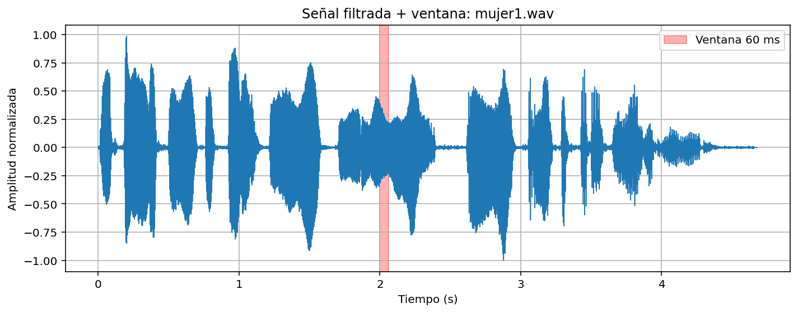
</p>
<p align="center">
  <em>señal filtrada + ventana: mujer1</em>
</p>

<p align="center">
  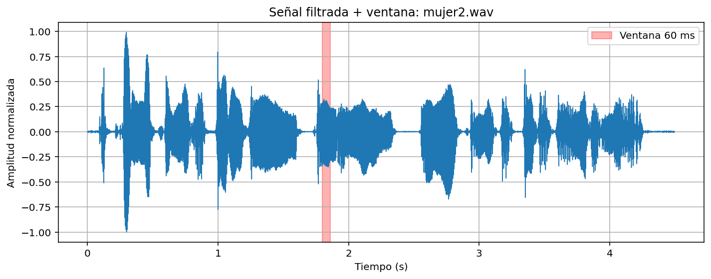
</p>
<p align="center">
  <em>señal filtrada + ventana: mujer2</em>
</p>

<p align="center">
  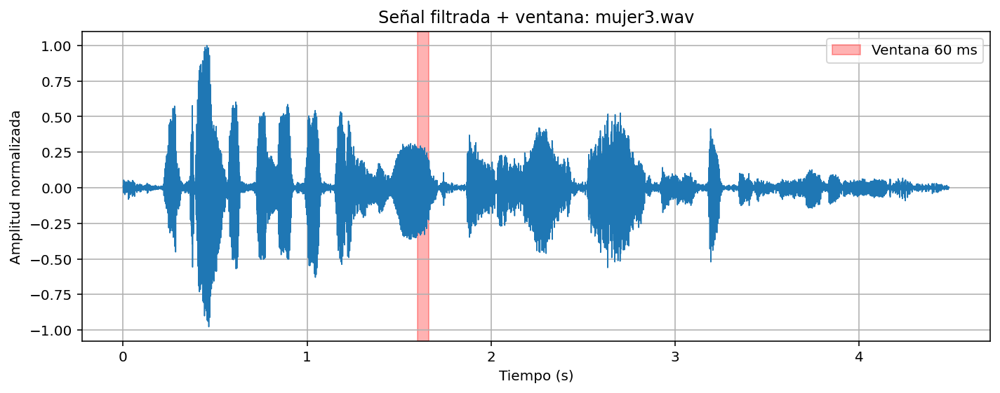
</p>
<p align="center">
  <em>señal filtrada + ventana: mujer3</em>
</p>

<p align="center">
  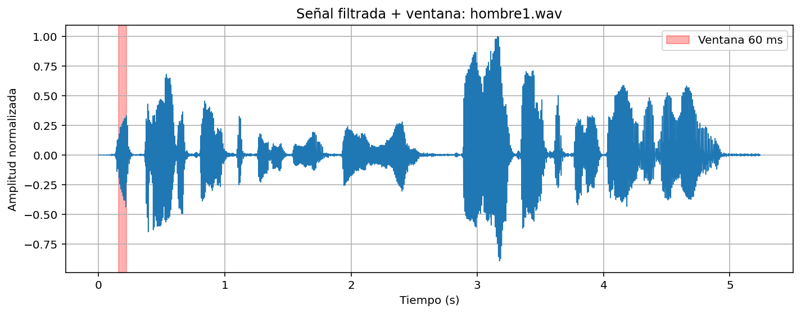
</p>
<p align="center">
  <em>señal filtrada + ventana: hombre1</em>
</p>

<p align="center">
  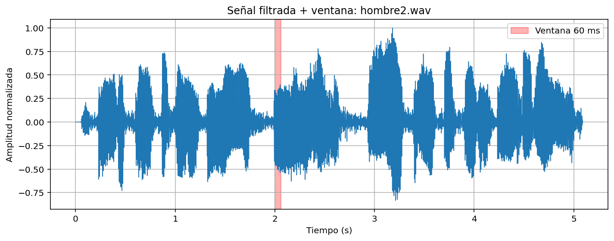
</p>
<p align="center">
  <em>señal filtrada + ventana: hombre2</em>
</p>

<p align="center">
  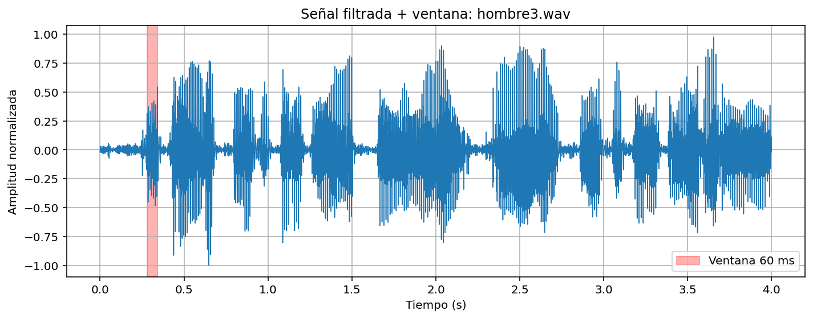
</p>
<p align="center">
  <em>señal filtrada + ventana: hombre3</em>
</p>

Aplicar la FFT sobre la ventana de 60 ms en lugar de toda la señal da una estimación de F0 más representativa del momento donde se medirán jitter y shimmer. La resolución espectral de la ventana es `fs/N ≈ 16.7 Hz`, lo que da una precisión de ±8 Hz en la estimación de F0: suficiente para calcular el período glótico con el nivel de detalle requerido.

---

#### Paso 14: Detección de ciclos glóticos

Con la F0 estimada se calcula el período aproximado en muestras y se busca el pico máximo dentro de cada segmento sucesivo. Este método basado en segmentación es efectivo para señales quasi-periódicas en regiones estables.

```python
periodo = int(fs / f0_ventana) if f0_ventana > 0 else int(fs / 200)
desfase = int(periodo * 0.2)

picos_idx = []
picos_amp = []

i = desfase
while i + periodo < len(ventana):
    segmento  = ventana[i: i + periodo]
    idx_local = np.argmax(segmento)
    picos_idx.append(i + idx_local)
    picos_amp.append(segmento[idx_local])
    i += periodo

tiempos   = np.array(picos_idx) / fs
picos_amp = np.array(picos_amp)
```

El desfase inicial de `0.2 × período` es intencional: evita capturar un pico incompleto al comienzo de la ventana. Esto explica por qué el número de ciclos detectados es sistemáticamente uno menos que el esperado teóricamente, como se puede verificar en los resultados: a 200 Hz se esperan ~12 ciclos en 60 ms y se detectan 11; a 350 Hz se esperan ~21 y se detectan 20, y así sucesivamente. Es una diferencia predecible, no un error del algoritmo.

---

#### Paso 15 y 16: Jitter y Shimmer

Con los tiempos de cada pico (Ti) y sus amplitudes (Ai) se calculan las cuatro métricas de estabilidad vocal. El jitter mide la variabilidad ciclo a ciclo en la frecuencia de vibración de las cuerdas vocales; el shimmer mide la variabilidad ciclo a ciclo en la amplitud.

$$Jitter_{abs} = \frac{1}{N-1} \sum_{i=1}^{N-1} |T_i - T_{i+1}|$$

$$Jitter_{rel}(\%) = \frac{Jitter_{abs}}{\bar{T}} \times 100$$

$$Shimmer_{abs} = \frac{1}{N-1} \sum_{i=1}^{N-1} |A_i - A_{i+1}|$$

$$Shimmer_{rel}(\%) = \frac{Shimmer_{abs}}{\bar{A}} \times 100$$

```python
Ti = np.diff(tiempos)
Ai = picos_amp

# Se descartan períodos a más de 2σ de la media: son errores de detección,
# no variaciones reales de la voz, y sesgarían el jitter al alza
Ti = Ti[np.abs(Ti - np.mean(Ti)) < 2 * np.std(Ti)]

jitter_abs = np.mean(np.abs(np.diff(Ti)))
jitter_rel = (jitter_abs / np.mean(Ti)) * 100

shimmer_abs = np.mean(np.abs(np.diff(Ai)))
shimmer_rel = (shimmer_abs / np.mean(np.abs(Ai))) * 100

print(f"  Jitter  abs : {jitter_abs:.6f} s  |  rel : {jitter_rel:.4f} %")
print(f"  Shimmer abs : {shimmer_abs:.6f}    |  rel : {shimmer_rel:.4f} %")
```

---

### PARTE C — Comparación y visualización

```python
import pandas as pd

df = pd.DataFrame(resumen)
df["Género"] = df["Archivo"].apply(lambda x: "Mujer" if "mujer" in x else "Hombre")
print(df.drop(columns=["Género"]).to_string(index=False))
```

```python
parametros = [
    ("F0 (Hz)",          "Frecuencia Fundamental F0 (Hz)"),
    ("Frec. Media (Hz)", "Frecuencia Media / Brillo (Hz)"),
    ("RMS",              "Intensidad RMS"),
    ("Jitter rel (%)",   "Jitter relativo (%)"),
    ("Shimmer rel (%)",  "Shimmer relativo (%)"),
]

fig, axes = plt.subplots(2, 3, figsize=(15, 9))
fig.suptitle("Comparación Hombres vs Mujeres — Parámetros Espectrales",
             fontsize=14, fontweight='bold')

for ax, (col, titulo) in zip(axes.flatten(), parametros):
    mujeres = df[df["Género"] == "Mujer"][col].values
    hombres = df[df["Género"] == "Hombre"][col].values
    bp = ax.boxplot([mujeres, hombres],
                    labels=["Mujer", "Hombre"],
                    patch_artist=True,
                    medianprops=dict(color='black', linewidth=2))
    bp['boxes'][0].set_facecolor('#f4a0b0')
    bp['boxes'][1].set_facecolor('#a0c4f4')
    ax.set_title(titulo, fontsize=10)
    ax.grid(True, linestyle='--', alpha=0.6)

axes.flatten()[-1].axis("off")
plt.tight_layout()
plt.show()
```

```python
from matplotlib.patches import Patch

colores = ['#e07b9a' if 'mujer' in a else '#5b9bd5' for a in df["Archivo"]]
plt.figure(figsize=(10, 5))
bars = plt.bar(df["Archivo"], df["F0 (Hz)"], color=colores,
               edgecolor='black', linewidth=0.7)
plt.title("Frecuencia Fundamental F0 por grabación", fontsize=13)
plt.ylabel("F0 (Hz)")
plt.xlabel("Archivo")
plt.grid(axis='y', linestyle='--', alpha=0.6)
for bar, val in zip(bars, df["F0 (Hz)"]):
    plt.text(bar.get_x() + bar.get_width() / 2, bar.get_height() + 2,
             f"{val:.0f}", ha='center', va='bottom', fontsize=9)
leyenda = [Patch(facecolor='#e07b9a', label='Mujer'),
           Patch(facecolor='#5b9bd5', label='Hombre')]
plt.legend(handles=leyenda)
plt.tight_layout()
plt.show()
```

---

## Resultados

### Tabla resumen de parámetros espectrales

| Archivo | F0 (Hz) | Frec. Media / Brillo (Hz) | RMS | Ciclos | Jitter abs (s) | Jitter rel (%) | Shimmer abs | Shimmer rel (%) |
|---|---|---|---|---|---|---|---|---|
| **mujer1.wav** | 200.00 | 2705.12 | 0.1402 | 11 | 0.000058 | 1.1412 | 0.019952 | 6.7602 |
| **mujer2.wav** | 200.00 | 1270.36 | 0.1172 | 11 | 0.000049 | 0.9767 | 0.013031 | 4.4442 |
| **mujer3.wav** | 350.00 | 1694.79 | 0.0869 | 20 | 0.000086 | 2.9778 | 0.018023 | 7.1003 |
| **hombre1.wav** | 133.33 | 2076.72 | 0.1342 | 7 | 0.000162 | 2.0717 | 0.022396 | 8.6380 |
| **hombre2.wav** | 116.67 | 1921.72 | 0.2273 | 6 | 0.000104 | 1.2742 | 0.027767 | 8.4194 |
| **hombre3.wav** | 100.00 | 1747.75 | 0.2000 | 5 | 0.000472 | 4.4996 | 0.039424 | 10.2410 |

### Promedios por género

| Parámetro | Mujeres | Hombres |
|---|---|---|
| F0 (Hz) | **250.00** | **116.67** |
| Brillo / Frec. Media (Hz) | **1890.09** | **1915.40** |
| RMS | **0.1148** | **0.1872** |
| Jitter relativo (%) | **1.6986** | **2.6152** |
| Shimmer relativo (%) | **6.1016** | **9.0995** |

---

## Análisis de Resultados

### Frecuencia Fundamental (F0)

Los resultados confirman la diferencia esperada por género. Las tres voces femeninas presentaron F0 de 200, 200 y 350 Hz con un promedio de 250 Hz, mientras que las tres masculinas registraron 133.33, 116.67 y 100 Hz con un promedio de 116.67 Hz. La diferencia supera una octava musical: las cuerdas vocales femeninas vibran más del doble de rápido que las masculinas en promedio.

Esto tiene origen anatómico directo. En la pubertad, la testosterona produce el crecimiento de la laringe masculina: las cuerdas vocales pasan de los 12–17 mm de la infancia, compartidos por ambos sexos, a 17–25 mm en el hombre adulto, mientras que en la mujer quedan entre 12–17 mm. Una cuerda vocal más larga y masiva vibra más lentamente, igual que una cuerda de guitarra más larga produce un sonido más grave. La nuez de Adán es la manifestación externa de ese crecimiento.

El caso de mujer3.wav con F0 = 350 Hz es el valor más alto del grupo. Esta hablante produce una voz notablemente más aguda que las otras dos, lo que puede deberse a cuerdas vocales particularmente cortas o tensas, a que el fragmento analizado corresponde a un segmento de entonación ascendente, o a características individuales de su tracto vocal. Por otro lado, hombre3.wav con F0 = 100 Hz es el registro más grave, con cuerdas vocales que vibran cada 10 ms. Los 5 ciclos detectados en su ventana de 60 ms son completamente coherentes: a 100 Hz caben 6 ciclos en 60 ms, y el desfase inicial del algoritmo descarta el primero, quedando 5.

La coherencia entre el número de ciclos detectados y la F0 se verifica en todos los casos:

| Archivo | F0 (Hz) | Período (ms) | Ciclos esperados | Ciclos detectados |
|---|---|---|---|---|
| mujer1.wav | 200 | 5.0 | ~12 | 11 ✓ |
| mujer2.wav | 200 | 5.0 | ~12 | 11 ✓ |
| mujer3.wav | 350 | 2.86 | ~21 | 20 ✓ |
| hombre1.wav | 133 | 7.5 | ~8 | 7 ✓ |
| hombre2.wav | 117 | 8.6 | ~7 | 6 ✓ |
| hombre3.wav | 100 | 10.0 | ~6 | 5 ✓ |

### Frecuencia Media y Brillo (Centroide Espectral)

El centroide espectral no mostró una separación clara entre géneros: los promedios fueron casi idénticos (1890 Hz mujeres vs. 1915 Hz hombres). Esto se explica porque el centroide calculado sobre la señal completa incluye la contribución de todos los fonemas de la frase: consonantes fricativas como /s/ o /f/ concentran energía en frecuencias altas (2–8 kHz) y elevan el centroide independientemente del género. Las diferencias de timbre individual entre hablantes también influyen tanto o más que el género sobre este parámetro.

El caso extremo de mujer1.wav con brillo = 2705 Hz, el más alto de todo el grupo incluyendo los hombres, ilustra este punto: esta hablante probablemente pronunció más consonantes fricativas o tiene un timbre naturalmente brillante que eleva su centroide por encima del promedio de su género. El centroide sería más discriminativo entre géneros si se calculara exclusivamente sobre segmentos vocálicos sostenidos, donde la fuente glótica domina el espectro y las diferencias de F0 se reflejan de forma más directa.

### Intensidad RMS

Los hombres presentaron mayor RMS promedio (0.187) que las mujeres (0.115). Este resultado debe interpretarse con cautela porque las señales fueron normalizadas a [-1, 1] antes del cálculo. La normalización elimina las diferencias absolutas de ganancia entre micrófonos pero no altera las diferencias de dinámica interna: una señal donde las vocales dominan ampliamente sobre las consonantes tendrá mayor RMS que una señal más balanceada, aun después de normalizar. Los hombres de este grupo parecen haber producido señales con menos contraste dinámico interno, lo que eleva su RMS relativo. En un experimento con grabación calibrada a distancia e intensidad estándar, no se esperaría una diferencia sistemática de RMS por género.

### Jitter — Variabilidad en la Frecuencia Fundamental

El jitter relativo varía entre 0.9767% (mujer2) y 4.4996% (hombre3), con promedio de 1.70% en mujeres y 2.62% en hombres. El umbral clínico de referencia es ≲ 1.04%:

| Archivo | Jitter rel (%) | Respecto al umbral |
|---|---|---|
| mujer2.wav | 0.9767 | Dentro del rango normal |
| mujer1.wav | 1.1412 | Ligeramente por encima |
| mujer3.wav | 2.9778 | Elevado |
| hombre1.wav | 2.0717 | Elevado |
| hombre2.wav | 1.2742 | Ligeramente por encima |
| hombre3.wav | 4.4996 | Considerablemente elevado |

Los valores por encima del umbral no implican patología vocal en los participantes. Hay cuatro razones técnicas que inflan el jitter estimado en este experimento: las grabaciones se hicieron con micrófonos de teléfono en entornos con ruido ambiental; se analizaron frases completas en lugar de vocales sostenidas, que es lo que exigen los estándares clínicos; el método de detección de picos por segmentación fija es menos preciso que la autocorrelación usada en software especializado como Praat; y con solo 5–11 ciclos por ventana, la estimación estadística del jitter tiene mayor varianza que con los 20–50 ciclos recomendados en análisis clínico. Lo que sí es válido es la comparación relativa dentro del experimento: mujer2.wav fue la voz más estable y hombre3.wav la más variable.

### Shimmer — Variabilidad en la Amplitud

El shimmer relativo oscila entre 4.44% (mujer2) y 10.24% (hombre3). Los hombres presentaron sistemáticamente mayor shimmer promedio (9.10%) que las mujeres (6.10%). El umbral de referencia es ≲ 3.81%, superado por todos los participantes por las mismas razones técnicas descritas para el jitter.

La tendencia relativa, hombres con mayor shimmer que mujeres, es consistente con lo reportado en la literatura para voces masculinas graves: la mayor masa de las cuerdas vocales y la mecánica de cierre glótico a frecuencias bajas producen mayor variabilidad de amplitud ciclo a ciclo. El hecho de que mujer2.wav presente simultáneamente los valores más bajos de jitter y shimmer es coherente: las cuerdas vocales que vibran de forma estable en frecuencia también tienden a hacerlo en amplitud, y estos dos parámetros correlacionan positivamente en condiciones normales.

---

## Importancia Clínica del Jitter y Shimmer

El jitter y shimmer son herramientas de uso extendido en evaluación fonoaudiológica porque reflejan directamente la regularidad de la vibración glótica. Su aumento está asociado a nódulos vocales (que impiden el cierre glótico uniforme elevando el shimmer), parálisis de cuerdas vocales (asimetría en la vibración que eleva ambos parámetros), enfermedad de Parkinson (el temblor en la musculatura laríngea produce un patrón de jitter oscilatorio característico), disfonía espasmódica (contracciones involuntarias del músculo tiroaritenoideo), y estadios tempranos de cáncer de laringe donde la masa o tensión glótica se altera antes de que el tumor sea visible.

Sin embargo, tienen limitaciones importantes para la detección de disartrias y afasias. Las disartrias son trastornos motores del habla que afectan la articulación, la resonancia y la prosodia, pero cuyo origen está en el control neuromuscular de los articuladores (labios, lengua, paladar), no en la fuente glótica. Un paciente disártrico puede tener un jitter completamente normal si sus cuerdas vocales funcionan bien, aun cuando su habla sea ininteligible por problemas articulatorios. Los parámetros más relevantes para disartria son la tasa de articulación, la precisión de consonantes y la variabilidad prosódica.

Las afasias son trastornos del lenguaje de origen cortical que afectan la comprensión, la producción y la organización lingüística. Son alteraciones cognitivo-lingüísticas, no fónicas: el mecanismo de fonación puede estar completamente intacto en un paciente afásico. Además de esta limitación de especificidad, el jitter y shimmer tienen alta dependencia del método de detección de ciclos, sensibilidad al ruido de grabación, considerable variabilidad inter-sujeto en voces sanas, y requieren voz sostenida estable en condiciones controladas para ser diagnósticamente fiables, algo que no siempre es posible en evaluación clínica real.

---

## Preguntas para la Discusión

### ¿Cómo es la F0 masculina respecto a la femenina? ¿Y el RMS?

La F0 de la voz masculina es considerablemente menor que la femenina. En los datos de este experimento, el promedio masculino fue 116.67 Hz versus 250 Hz en mujeres, una diferencia de más de una octava. Esto se observa en la densidad espectral de potencia como un primer pico ubicado en frecuencias mucho más bajas en los hombres. La causa es anatómica: las cuerdas vocales masculinas miden entre 17 y 25 mm tras la pubertad, mientras que las femeninas quedan entre 12 y 17 mm. Una cuerda más larga y masiva vibra más lentamente, produciendo una F0 menor. En cuanto al RMS, los hombres de este grupo presentaron mayor promedio (0.187 vs. 0.115), pero este resultado está influenciado por las diferencias de dinámica interna de cada grabación después de la normalización, y no refleja necesariamente una diferencia real en la intensidad vocal entre géneros.

### ¿Qué limitaciones tiene el jitter/shimmer para detectar disartrias y afasias?

La limitación más fundamental es de especificidad: el jitter y shimmer miden exclusivamente la regularidad de la fuente glótica, mientras que las disartrias y afasias afectan otros niveles del sistema de habla y lenguaje que no se reflejan en estos parámetros. A esto se suman limitaciones metodológicas: diferentes algoritmos de detección de ciclos producen valores distintos sobre la misma grabación; el ruido ambiental introduce variabilidad espuria difícil de separar de la variabilidad real; la variabilidad inter-sujeto en voces sanas tiene considerable solapamiento con rangos patológicos, haciendo que los umbrales absolutos no tengan suficiente sensibilidad ni especificidad diagnóstica sin una evaluación complementaria; y el cálculo requiere vocales sostenidas estables, no habla espontánea, lo que limita su aplicabilidad en la evaluación de la comunicación funcional en pacientes con disartria o afasia.

---

## Conclusiones

La F0 demostró ser el parámetro de mayor poder discriminativo entre géneros y el más robusto metodológicamente. Los datos confirmaron de forma consistente que las voces femeninas tienen F0 significativamente más alta (promedio 250 Hz) que las masculinas (promedio 116.67 Hz), en plena concordancia con las diferencias anatómicas de la laringe y el efecto diferencial de la testosterona durante la pubertad. Este resultado se mantuvo estable incluso con grabaciones en condiciones no controladas, lo que confirma que la F0 es un discriminador fiable incluso fuera de entornos clínicos.

El centroide espectral no discriminó géneros de forma comparable. Los promedios por grupo fueron casi idénticos (1890 vs. 1915 Hz), evidenciando que este parámetro está fuertemente influenciado por el contenido fonético de la frase y el timbre individual, más que por el género. Su utilidad discriminativa aumentaría si se calculara exclusivamente sobre segmentos vocálicos sostenidos.

La coherencia entre el número de ciclos detectados en la ventana de 60 ms y la F0 estimada en todos los casos valida internamente el algoritmo de detección de picos. Las diferencias de un ciclo respecto al valor teórico son predecibles y se explican correctamente por el desfase inicial intencional del código.

Los valores absolutos de jitter y shimmer excedieron los umbrales clínicos de referencia en la mayoría de los sujetos, pero esto era esperable dado que se trabajó con frases completas grabadas con teléfonos en entornos no controlados y con un método de detección de picos menos preciso que el de software clínico especializado. La comparación relativa dentro del experimento sí es válida: mujer2.wav presentó los valores más bajos de estabilidad vocal de todo el grupo, y hombre3.wav los más altos, con los hombres mostrando sistemáticamente mayor jitter y shimmer promedio que las mujeres.

El análisis espectral de voz desarrollado en este laboratorio tiene aplicabilidad biomédica directa en áreas como el screening de patologías vocales, el monitoreo de la respuesta a tratamientos de logopedia, la detección temprana de enfermedades neurológicas que afectan la fonación como el Parkinson, y el desarrollo de sistemas de biometría por voz y telemedicina de bajo costo. La implementación en Python con librerías estándar demuestra que estas herramientas son accesibles, reproducibles y extensibles sin necesidad de infraestructura especializada.

---

## Cómo Reproducir el Análisis

```bash
pip install numpy scipy matplotlib pandas
```

```bash
git clone https://github.com/usuario/analisis-espectral-voz.git
cd analisis-espectral-voz
python analisis_voz.py
```

Ajustar en `analisis_voz.py` el diccionario `cortes` con los tiempos de inicio y fin de voz útil de cada grabación, y el diccionario `ventanas_usuario` con el segundo donde empieza una región de voz sostenida para la ventana de 60 ms.

| Variable | Descripción | Valor usado |
|---|---|---|
| `cortes` | Tiempos de inicio y fin de voz útil por archivo | Definidos por inspección visual |
| `ventanas_usuario` | Inicio de la ventana de 60 ms | Definidos sobre región estable |
| `ventana_ms` | Duración de la ventana de análisis | 60 ms |
| `fmin, fmax` (hombre) | Rango de búsqueda de F0 | 80–400 Hz |
| `fmin, fmax` (mujer) | Rango de búsqueda de F0 | 150–500 Hz |
| Orden Butterworth | Selectividad del filtro | 4 |

---

## Bibliografía

```
[1] A. V. Oppenheim, A. S. Willsky y S. H. Nawab, Signals and systems.
    Upper Saddle River, NJ, USA: Pearson Educación, 1997.

[2] D. Paul, M. Pal y G. Saha, "Spectral features for synthetic speech detection,"
    IEEE Journal of Selected Topics in Signal Processing, vol. 11, no. 4,
    pp. 605–617, Jun. 2017.
    https://doi.org/10.1109/JSTSP.2017.2684705

[3] M. Kleinschmidt, "Localized spectro-temporal features for automatic speech
    recognition," en Interspeech, 2003, pp. 2573–2576.

[4] S. A. Alim y N. K. A. Rashid, Some commonly used speech feature extraction
    algorithms, London, UK: IntechOpen, 2018, pp. 2–19.
    https://doi.org/10.5772/intechopen.80419

[5] B. Iser, W. Minker y G. Schmidt (eds.), Bandwidth extension of speech signals,
    Boston, MA, USA: Springer US, 2008.
    https://doi.org/10.1007/978-0-387-68899-2
```

---

<div align="center">

**Universidad Militar Nueva Granada · Ingeniería Biomédica · 2026**  
*Procesamiento Digital de Señales — Práctica de Laboratorio: Análisis Espectral de la Voz*

</div>
